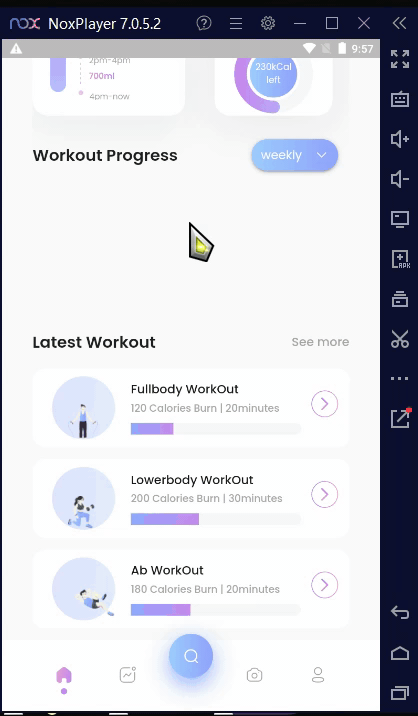
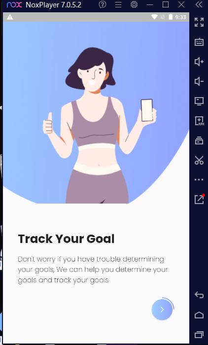
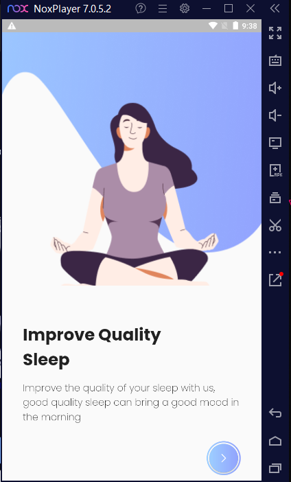
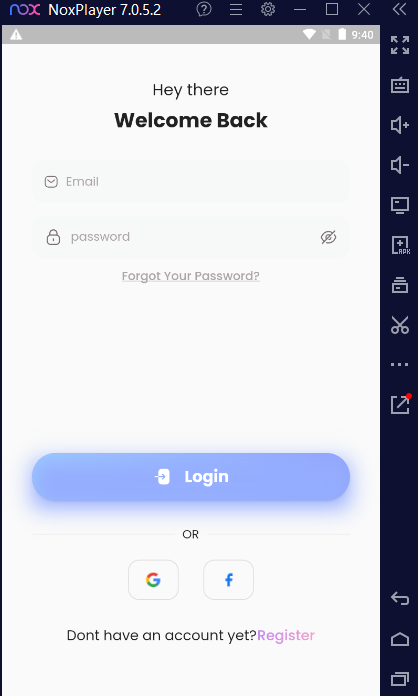
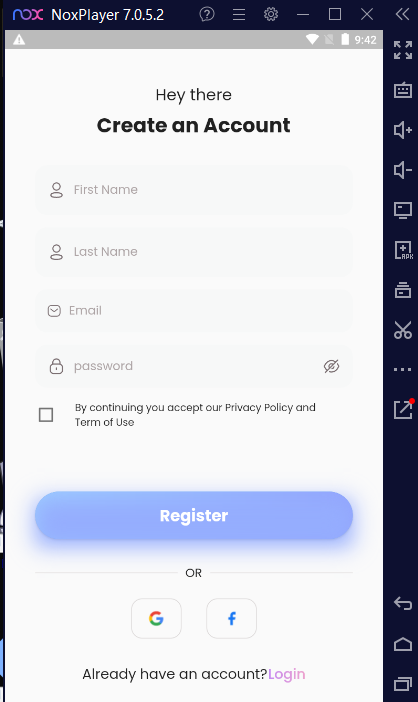
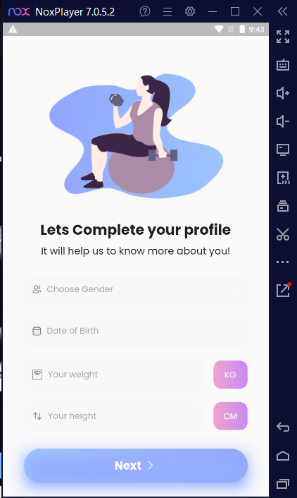
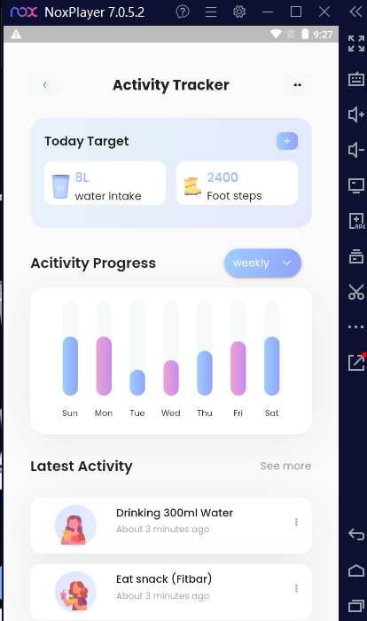

# Fitness App UI 

A Flutter UI of a Fitness App I found on Figma community.
Design screens are on (https://www.figma.com/community/file/1047728853861186038)

Don't forget to star⭐ the repo if you like what you see😉.

# 🎥 Demo

# Project Description

This is a Flutter UI for a fitness app that allows users to track their workouts, nutrition, and progress. The app features a modern and intuitive design, with a focus on usability and user engagement. This project uses Clean Architecture to organize the codebase into separate layers and promote code quality, testability, and maintainability.

# Technologies Used

- Flutter
- Dart

# Clean Architecture

This project uses Clean Architecture to separate the code into three layers:

-Presentation Layer: This layer contains the widgets that represent the screens of the app. It includes the controllers and presenters that manage the interaction between the UI and the domain layer. The controllers and presenters are testable and independent of the UI framework.
-Domain Layer: This layer contains the business logic and rules of the app. It includes the use cases that define the interactions between the app and the user. The use cases are independent of the UI and the data layer.
-Data Layer: This layer is responsible for storing and retrieving data from external sources, such as a database or a web API. It includes repositories that abstract the data sources and provide a clear interface for the domain layer to access the data.

# Usage

The app includes the following screens:
-onboarding Screens : These are the screens that appear when the app is starting up
-Login Screen: This screen allows users to log in to their account.
-SignUp Scren: This screen allows users to create a new account.
-Home Screen: This screen displays a dashboard with an overview of the user's progress and goals.
-Profile Screen: This screen allows users to edit their account settings.
-Activity Screen: This screen allows users to track their progress .

# 📸 Screenshots

The screenshots below are taken on a android emulator.

| 1                                                               | 2                                                              |
| --------------------------------------------------------------- | -------------------------------------------------------------- |
|  |  |

| 3                                                 | 4                                                   |
| ------------------------------------------------- | --------------------------------------------------- |
|  |  |

| 5                                                        | 6                                                               |
| -------------------------------------------------------- | --------------------------------------------------------------- |
|  |  |

| 7                                                        | 8                                                               |
| -------------------------------------------------------- | --------------------------------------------------------------- |
|  |  |

# ✨ Requirements

- Any Operating System (ie. MacOS X, Linux, Windows)
- Any IDE with Flutter SDK installed (ie. IntelliJ, Android Studio, VSCode etc)
- A little knowledge of Dart and Flutter
- Some fingers to code 😂

## Getting Started

To run the app on your local machine, follow these steps:

-Clone the repository to your local machine.
-Install Flutter and its dependencies on your machine.
-Run 'flutter pub get' to install the dependencies.
-Run 'flutter run' to start the app.
